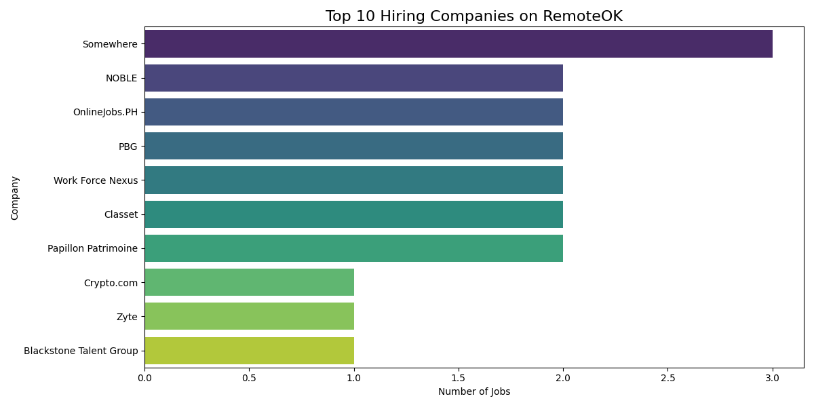
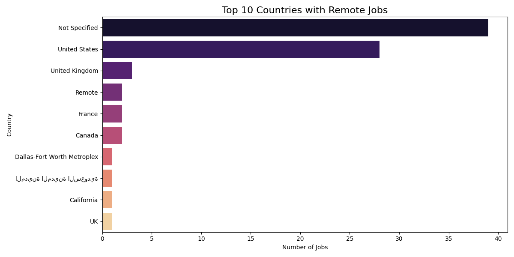
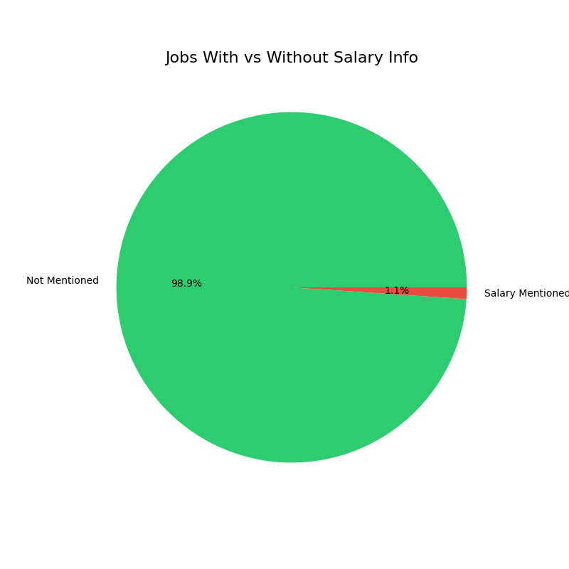

#  Remote Job Market Analysis - Web Scraping Project

## 📋 Project Overview
This project analyzes remote job postings from RemoteOK.com 
using web scraping techniques. Built as part of the 
Coursera Data Analysis course.

## Project Objectives
- Increase efficiency of job vacancy sourcing
- Improve quality of job vacancy sourcing
- Gain competitive advantage for recruitment agency

## Tools & Libraries Used
- **Python 3.10**
- **Requests** - API data collection
- **BeautifulSoup** - Web scraping
- **Pandas** - Data cleaning & analysis
- **Matplotlib** - Data visualization
- **Seaborn** - Data visualization

##  Key Findings
-  Total Jobs Scraped: 94
- Unique Companies: 86
- Countries Represented: 24
- Date Range: June 12-18, 2026
-  98.9% jobs did not mention salary
- 🇺🇸 USA had most remote jobs (23)

## 📈 Visualizations

##  Project Files
| File | Description |
|---|---|
| `job_scraping_project.ipynb` | Main notebook |
| `remote_jobs.csv` | Raw scraped data |
| `remote_jobs.xlsx` | Excel format data |
| `top_companies.png` | Companies chart |
| `top_countries.png` | Countries chart |
| `salary_info.png` | Salary chart |

##  Data Source
- **Website:** https://remoteok.com
- **API:** https://remoteok.com/remote-dev-jobs.json

## Conclusions
1. USA dominates remote job market
2. Most companies do not disclose salary
3. Remote work is truly global across 24 countries
4. Administrative and tech roles are most common

## Limitations
- Data limited to 100 jobs per API call
- Salary data mostly unavailable
- Location data inconsistent for some jobs
